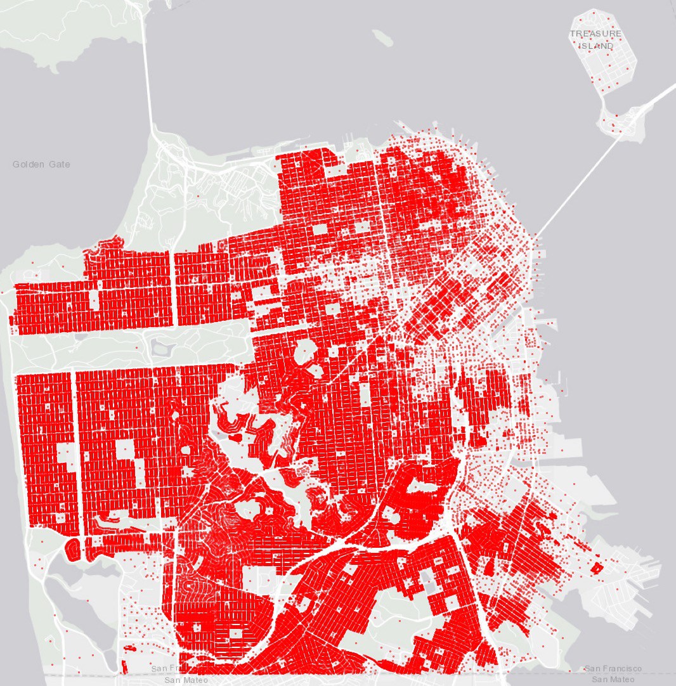

E1 - Basic HAZUS
===========================

+-----------------+---------------------------------------------+
| Download files  | :github:`Download <Examples/E1BasicHAZUS/>` |
+-----------------+---------------------------------------------+

This earthquake example demonstrates rapid analysis capabilities with the HAZUS earthquake damage and loss assessment methodology. Building-level Damage and Losses (D&L) are calculated directly from Intensity Measures (IM) for 25 assets. The IM field that represents peak ground acceleration in the city of San Francisco, CA, from an Mw7.2 event on the San Andreas fault, was obtained from Probabilistic Seismic Hazard Analysis (PSHA).

This study will be defined by sequentially traversing the input panels of the **R2D** interface. However, as outlined in the online user's manual, these procedures can be serialized to and loaded immediately from a JSON file, which for this example may be found :github:`here <Examples/E3PhysicsBasedGroundMotions/input.json>`.

#. **GI** The unit system and asset type are prescribed in this panel, and we're interested in the **building engineering demand parameters**, **damage measures**, and the resulting **decision variables**.

   .. figure:: figures/r2dt-0006-GI.png
      :width: 600px
      :align: center

#. **HAZ** Next, the hazard panel is used to load the event grid ``.csv`` file (:github:`view on Github <Examples/E1BasicHAZUS/input_data/San_Andreas_Mw72/EventGrid.csv>`) which lists out the ground motions which are used as the ground acceleration time history inputs in this example.

   .. figure:: figures/r2dt-0006-HAZ.png
      :width: 600px
      :align: center

#. **ASD** In the asset definition panel, the path to the :github:`SanFranciscoBuildings.csv <Examples/E1BasicHAZUS/input_data/SanFrancisco_buildings.csv>` file is specified. Once this file is loaded, the user can select which particular assets will be included in the analysis by entering a valid range (e.g., 1-50) in the form and clicking **Select**. The ``SanFranciscoBuildings_full.csv`` file includes parameters for the damage and loss assessment (e.g., number of stories, year of built, occupancy class, structure type, and plan area) for more than 100,000 buildings in the community.

   .. figure:: figures/r2dt-0006-ASD.png
      :width: 600px
      :align: center

#. **HTA** Next, a hazard mapping algorithm is specified using the **Nearest Neighbour** method and the **SimCenterEvent** application, which are configured as show in the following figure with **3** samples in **4** neighborhoods, i.e., randomly sampling 5 ground motions from the nearest four stations (each station has one ground motion recording specified in the **HAZ**).

   .. figure:: figures/r2dt-0006-HTA.png
      :width: 600px
      :align: center

#. The **MOD** panel is not used for this procedure. The **Building Modeling** dropdown should be left set to **None**.

#. **ANA** In the analysis panel, **IMasEDP** is selected from the primary dropdown.

   .. figure:: figures/r2dt-0006-ANA.png
      :width: 600px
      :align: center

#. **DL** The damage and loss panel is now used to configure the **Pelicun** backend. The **HAZUS MH EQ IM** damage and loss method is selected and configured as shown in the following figure:

   .. figure:: figures/r2dt-0006-DL.png
      :width: 600px
      :align: center

#. The **UQ** and **RV** panels will be left empty for this procedure.

#. **VIZ** The visualization panel in the following figure shows the location of the assets considered by this example.

   .. figure:: figures/r2dt-0006-VIZ.png
      :width: 600px
      :align: center

#. **RES** The final step is to click the **Run** button at the bottom of the application, after which the results panel will be populated with a variety of widgets which can be configured to one's heart's content as shown below:
   
   .. figure:: figures/r2dt-0006.png
      :width: 600px
      :align: center

   .. figure:: figures/r2dt-0006-FULL.png
      :width: 600px
      :align: center

